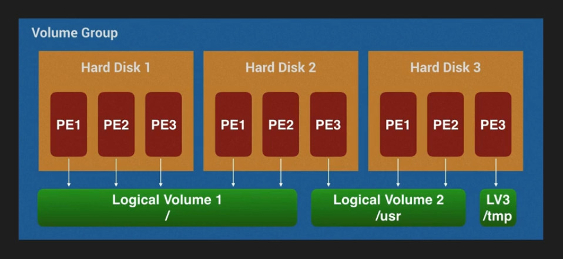

# Linux Hard Disk Layout
### Directories
- `/` - root directory or system drive directory.
- `/etc` - stores system configuration files.
- `/usr` - installed apps, packages, commands etc are stored here.
- `/home` - user home directory.
- `/boot` - stores bootloader and  required image files.
- `/var` - stores variable data like system logs, manuals etc.
- `/tmp` - stores temporary files and everyone has write permission in this directory/partition.

NOTE:  Any partition can be mounted to any directory. For more details check out `mount` cmd from `Important Commands` section.
 

### Partitions
- `swap` - virtual RAM to prevent system crash in case of memory overload.
- `tmp` - tmp should be in a different partition to avoid harming system by writing large number of junk files.
- `home` - home should be a different partition for the same reason as `tmp`.
- `boot` - same as before. To learn more check `Boot Loader` docs.
 

### LVM
It implies for Logical Volume Manager. If we have multiple hard disk and need to resize the partition or we want to make partition of a size that needs to combine 2 hard disk or more, we can do it through LVM. It split partitions into small pools and combine them to make partition. In the case of resize, it take pools from other partition and add them to the desired partition.

