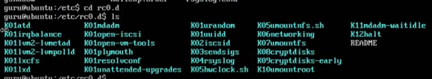

# Run Levels
There are total 7 run level from 0 to 6. This determine what to load when system init happens. Normally this happens automatically but we can manually configure it as we like.

- 0 -> Halt or shutdown system
- 1 -> Single user mode (safe mode - loads less program)
- 2 ->  multi-user mode without networking
- 3 -> Normal boot/Multi-user mode with networking
- 4 -> Unused/Customizable
- 5 -> Run level 3 with GUI Display Manager
- 6 -> Reboot
 

Run level are configured using one of this two method `systemd` or `systemv`. `systemd` is newer and optimized version of `systemv` with some new features but there are still some older system that uses `systemv` to this date.
 

# systemv
systemv used to use a file called `inittab` which located at `/etc/inittab`. It kind of looked like this,

And with this system know which run level to boot to. run levels are located at `/etc`. There are some folders named `rc0.d`, `rc1.d` etc. up to `rc6.d` and one additional `rc$.d`. Each of the `rc` folder contains scripts that will run on that corresponded run level. However, the scripts that `rc$.d` contains will run for all run level.

If we open any of the folder discussed above we will be able to see some file. Files that starts with `K` means kill and the number right after K like `K0`, `K01` etc are indicating the serial. We will see this normally at run level 0 and run level 6.

 

# systemd
It's located at `/etc/systemd`. It contains two types of scripts.
1.  System Scripts (`/etc/systemd/system`)
2.  Package Scrips (`/usr/lib/systemd/system`)

System scripts take precedence over package scripts.  Systemd also has a concept called targets.

## Targets
It's serves the same purpose as the run level but act little differently. Each target is named instead of numbered and is intended to serve a specific purpose. Where in systemv there were folder called `rc6.d` it's called here `reboot.target`. Some targets are implemented by inheriting all of the services of another target and adding additional services to it.

 
 

Example of `systemd` script for apache web server,

Same script for `systemv`

